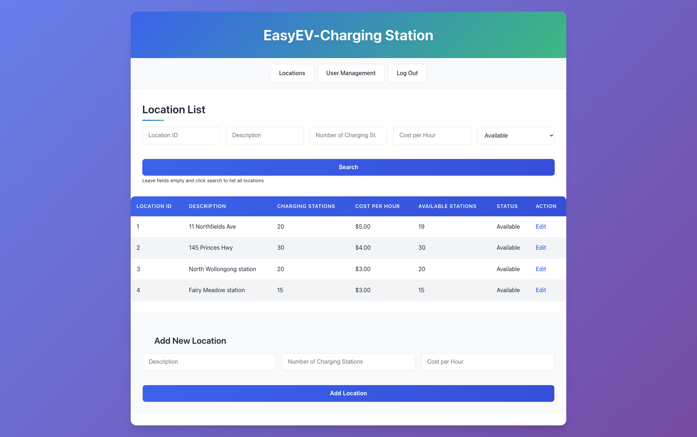
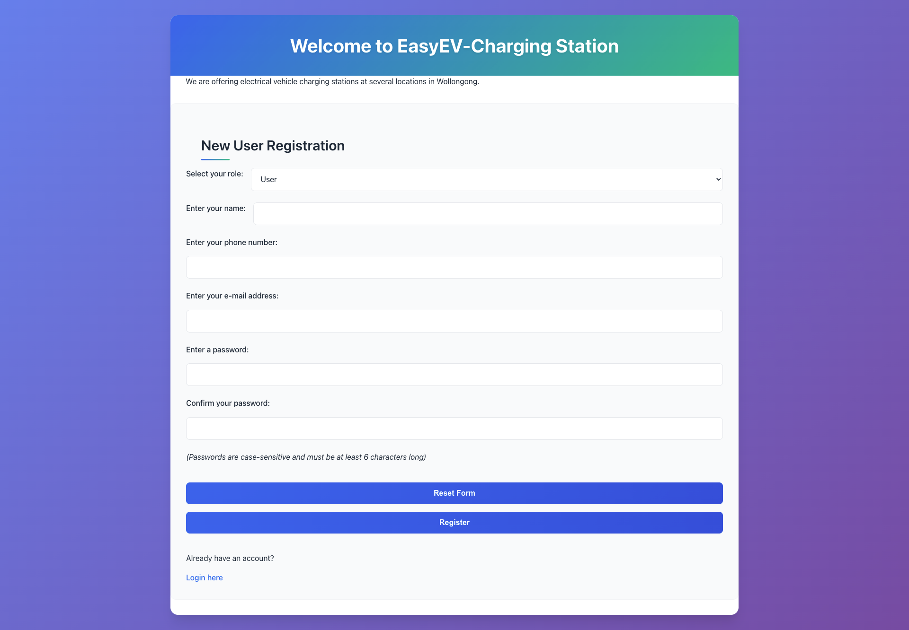

# EasyEV Charging Station Management System

A dynamic web application for managing electric vehicle charging stations across multiple locations. The system supports two user types (Administrator and User) with comprehensive charging session management and real-time station availability tracking.

## 🌐 Live Demo

**Live Deployment**: [https://easyev.infinityfreeapp.com/](https://easyev.infinityfreeapp.com/)

## 📸 Screenshots

### Location Management Interface (Admin View)



_Admin dashboard showing location management with search functionality, location list, and add new location form_

### User Registration Page



_User-friendly registration interface with role selection and form validation_

## Features

### User Capabilities

- **Location Management**: Search and view charging locations with real-time availability
- **Charging Sessions**: Check-in to start charging, check-out when complete
- **Cost Tracking**: View charging costs and session history
- **Session History**: Track past and current charging sessions

### Administrator Capabilities

- **Location Management**: Add, edit, and manage charging locations
- **User Management**: View all users and track active sessions
- **System Monitoring**: Monitor station availability and usage patterns
- **Comprehensive Reports**: Access detailed analytics on locations and users

## Technology Stack

- **Backend**: PHP with MySQL
- **Frontend**: HTML, CSS, JavaScript
- **Database**: MySQL with foreign key constraints
- **Security**: MD5 password hashing, session management, input validation

## Installation

### Prerequisites

- PHP 7.4 or higher
- MySQL 5.7 or higher
- Web server (Apache/Nginx) or MAMP/XAMPP for local development

### Setup Steps

1. **Clone the repository**

   ```bash
   git clone https://github.com/yourusername/EasyEV.git
   cd EasyEV
   ```

2. **Configure Database Connection**
   Edit `dbConnection.php` with your database credentials

   ```php
   $serverName = "localhost";    // Your database host
   $uname = "your_username";     // Your database username
   $serverPassword = "your_password";  // Your database password
   $dbName = "your_DBName"; // Your database Name
   ```

3. **Database Setup**

   - **⚠️ IMPORTANT**: You must manually create the database in your hosting control panel first
   - The application will automatically create tables on first run
   - Sample data will be inserted if tables are empty

4. **Deploy to InfinityFree**

   - Upload files to your InfinityFree hosting account using File Manager or FTP
   - Ensure proper file permissions are set

5. **Access the Application**
   - Open your browser and navigate to `yoursite.infinityfreeapp.com`
   - Create an account or use the registration form

## Project Structure

```
EasyEV/
├── styles.css              # Global CSS styles and responsive design
├── dbConnection.php        # Database connection and configuration
├── createTable.php         # Database schema creation and sample data
├── roleClass.php           # Core business logic and user management
├── index.php               # Homepage with login/registration
├── login.php               # User authentication handler
├── signup.php              # User registration handler
├── location_page.php       # Location management interface
├── edit_location.php       # Location editing interface
├── charging_page.php       # Charging session management
└── user_page.php           # User management (admin only)
```

## Deployment

### InfinityFree Hosting (Recommended)

1. **Sign up** at [InfinityFree](https://infinityfree.net) - **You must create your own account**
2. **Create hosting account** and note your database credentials
3. **⚠️ IMPORTANT: Manually create MySQL database** in the control panel:
   - Go to MySQL Databases in your control panel
   - Create a new database (e.g., `if0_XXXXXXXX_easyev`)
   - Note the exact database name, username, and password
4. **Upload files** using File Manager or FTP
5. **Update database connection** in `dbConnection.php`:
   ```php
   $serverName = "sqlXXX.infinityfree.com";  // Your MySQL hostname
   $uname = "if0_XXXXXXXX";                  // Your MySQL username
   $serverPassword = "your_password";        // Your MySQL password
   $dbName = "if0_XXXXXXXX_easyev";         // Your database name
   ```
6. **Access your site** at `yoursite.infinityfreeapp.com`

**Note**: Tables will be created automatically when you first access the site, but the database itself must be created manually in the hosting control panel first.

### Deployment Checklist

- [ ] Create InfinityFree hosting account
- [ ] Manually create MySQL database in control panel
- [ ] Update database credentials in `dbConnection.php`
- [ ] Upload all project files
- [ ] Test functionality on live server

## Database Schema

### Users Table

| Field    | Type             | Description                      |
| -------- | ---------------- | -------------------------------- |
| id       | INT (PK)         | Unique user identifier           |
| name     | VARCHAR          | User's full name                 |
| phone    | VARCHAR          | Contact phone number             |
| email    | VARCHAR (UNIQUE) | Email address (login credential) |
| password | VARCHAR          | Hashed password                  |
| type     | ENUM             | User type (administrator/user)   |

### Locations Table

| Field              | Type     | Description                       |
| ------------------ | -------- | --------------------------------- |
| locationId         | INT (PK) | Unique location identifier        |
| description        | VARCHAR  | Location description/name         |
| charging_station   | INT      | Total number of charging stations |
| cost_per_hour      | DECIMAL  | Hourly charging rate              |
| available_stations | INT      | Currently available stations      |

### Charging Sessions Table

| Field       | Type     | Description                         |
| ----------- | -------- | ----------------------------------- |
| chargingId  | INT (PK) | Unique session identifier           |
| userId      | INT (FK) | Reference to Users table            |
| locationId  | INT (FK) | Reference to Locations table        |
| start_time  | DATETIME | Session start timestamp             |
| finish_time | DATETIME | Session end timestamp               |
| cost        | DECIMAL  | Total session cost                  |
| status      | ENUM     | Session status (charging/completed) |

## API Endpoints

The application uses PHP classes with the following main methods:

- `searchLocation()` - Location search with filters
- `checkIn()` - Start charging session
- `checkOut()` - End charging session
- `insertLocation()` - Add new location (admin)
- `updateLocation()` - Update location details (admin)
- `searchUsers()` - User management (admin)

## Support

For support and questions, please open an issue in the GitHub repository.

---

**Note**: This is an educational project developed as part of a web development course. It demonstrates fundamental concepts in web application development, database design, and user authentication systems.

## License

This project is licensed under the MIT License - see the [LICENSE](LICENSE) file for details.
